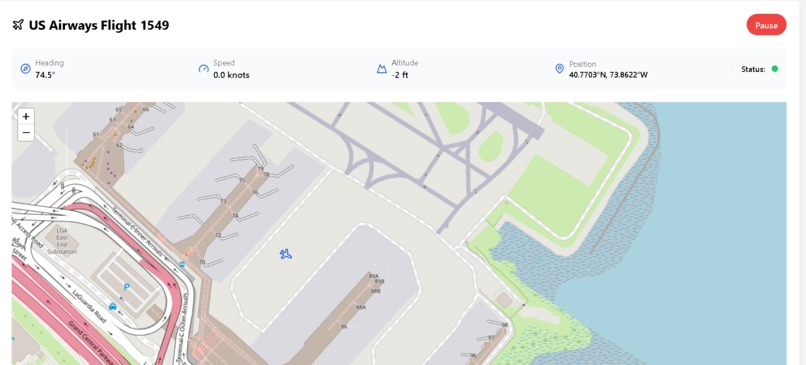

# ATC-Air-Traffic-Controller-AI
**UTA Datathon 2025**

Click here to view the app : https://bolt.new/~/sb1-dvkt2eg3

***Devpost Link: https://devpost.com/software/atc-air-traffic-controller-ai***

# Inspiration

Emergencies in aviation demand split-second decisions, but pilots are often overwhelmed, and ATC lacks real-time visibility. We wanted to solve this by bridging the communication and awareness gap using AI.

# What it does

ATC AI connects the aircraft's Flight Data Recorder (FDR) with existing ADS-B communication systems. It analyzes live flight data using AI to provide ATC with real-time insights into emergencies—without relying solely on verbal communication from pilots.

# How we built it

- Used Real FDR data and part of CVR from the Miracle on the Hudson Aviation Accident
- Used Python for real-time data processing and serial communication with Arduino.
- Integrated the Gemini API to analyze FDR (Flight Data Recorder) data and raise contextual warnings.
- Used AWS Transcribe to convert CVR (Cockpit Voice Recorder) audio into text for further analysis.
- Implemented parameter prioritization on FDR inputs to detect anomalies and trigger alerts based on criticality.
- Developed a front-end interface using StackBlitz for data visualization.
- Simulated aircraft behavior using CSV files representing real-time FDR logs.
- Controlled servos and LCDs with Arduino, mimicking physical cockpit instruments.
- Built a flag-based messaging protocol to clearly separate tasks (LCD display vs. servo movement).

# Challenges we ran into

- Dealing with missing or incomplete data rows while maintaining state.
- Lack of trained models with Flight Data caused issues with Gemini not detecting at first based solely on flight data, but when CVR Parameterization was pushed, it worked.

# Accomplishments that we're proud of

- Built a working prototype that integrates real-time data processing with physical servo responses and a Web App.
- Designed a system that clearly distinguishes between normal and emergency data flow using AI.
- Found an industry (aviation) where AI is used less and made sure it could be used for a better and safer skies

# What we learned
- The importance of real-time data analysis for critical systems like aviation.
- How to integrate diverse tools—AI (Gemini API), AWS Transcribe, and embedded hardware—into a unified system.
- Parameter prioritization plays a key role in detecting anomalies efficiently, especially under time constraints.
- Combining FDR and CVR analysis creates a richer, more complete picture of aircraft emergencies.
- Communication between hardware and software systems requires careful synchronization and reliability handling.
